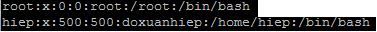

#Managing-groups-users

##I/File lưu trữ của các user

###1.Users

user phân thành 2 loại chính là *supperuser(root)* và *normaluser*

Đường dẫn:  
` /etc/passwd `

###2.Thông tin về file ` /etc/passwd `

Trường đầu của users là **username(tên user)**

Trường thứ hai của users là mật khẩu đã được ẩn đi bằng chữ *x*

Trường thứ ba của users là **UID(user id)**. *Đây chính là phân biệt xem user này thuộc loại supperuser hay normaluser*

Trường thứ tư của users là **GID(group id)**

Trường thứ năm của users là **user id infor**. *Đây là trường cho phép người dùng có thể thêm thông tin về mình*

Trường thứ sáu của user là **home directory**. *Đây là trường nói về đường dẫn tuyệt đối đến thư mục home*

Trường thứ bảy của user là  **command/shell**. *Đây là trường nói về command/shell(/bin/bash)